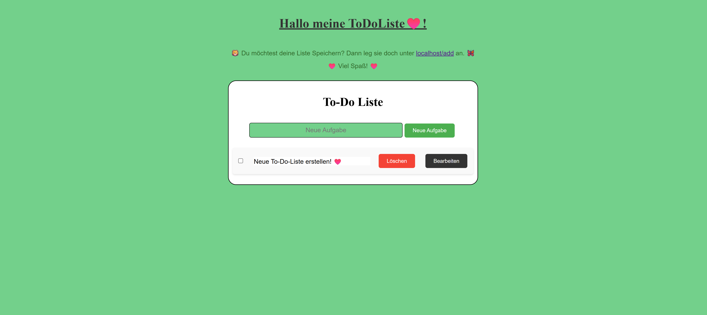
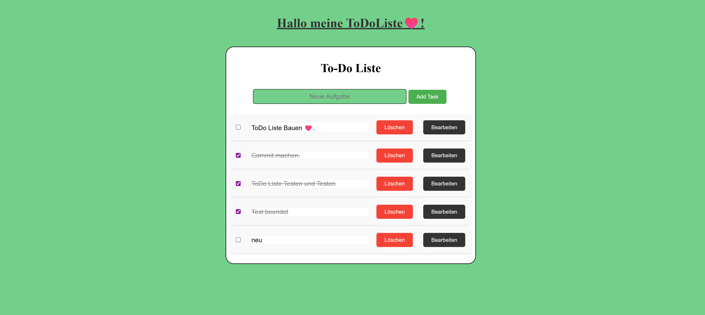

# 📝 Fullstack To-Do App

---

## 🧠 Project Overview

This project demonstrates a fullstack application architecture using a React frontend and an Express.js backend.

The application implements a REST-based task management system with full CRUD functionality. It integrates both SQLite and PostgreSQL to explore differences in database schemas and backend handling.

The frontend communicates with the backend through JSON-based API requests and also includes a local state mode on the homepage. This highlights the distinction between local UI state management and persistent database storage.

The project focuses on clean separation of frontend and backend services, REST API design, multi-database handling, and state management in React.

---

## 🎯 Features

- Create tasks  
- Edit tasks  
- Delete tasks  
- Mark tasks as completed  
- RESTful API communication  
- SQLite integration  
- PostgreSQL integration  
- Local state demo mode (homepage)  
- Separate frontend and backend environments  

---

## 🏗️ Architecture

**Frontend:**  
>React application built with Vite.  
Handles state management, controlled inputs, and dynamic rendering.  
Communicates with the backend via the Fetch API.

**Backend:**  
>Node.js with Express.  
Provides REST endpoints (GET, POST, PUT, DELETE).  
Handles database communication and JSON responses.

Frontend and backend run independently and communicate via HTTP on separate ports.

---

## 🖼️ Screenshots

### Homepage – Local State Mode

>The homepage operates in local state mode without backend persistence.  
It demonstrates UI logic, state updates, editing, toggling, and deletion handled purely in React.

---

### Database Mode – /add Route

>The `/add` route connects to the backend REST API.  
All CRUD operations are persisted in the database.  
This demonstrates full frontend-backend integration and API communication.

---

## ⚙️ Local Development Setup

### Backend

Navigate to the backend folder.  
Run `npm install` to install dependencies.  
Start the server using `npm start`.  
The backend runs on `http://localhost:5000`.

### Frontend

Navigate to the frontend folder in a separate terminal.  
Run `npm install` to install dependencies.  
Start the development server using `npm run dev`.  
The frontend runs on `http://localhost:5173`.

Both services must run simultaneously for full functionality.

---

## 🗄️ Database Handling

This project includes two database integrations.

SQLite was used for lightweight local testing and comparison.  
PostgreSQL was integrated to explore structured database handling.

Because the schemas differ slightly, conditional logic is implemented to handle schema differences between database systems.

---

## 📌 Status

Stable and fully functional.

This project demonstrates clear separation of frontend and backend architecture, REST API design, handling of multiple database schemas, and debugging frontend-backend communication.